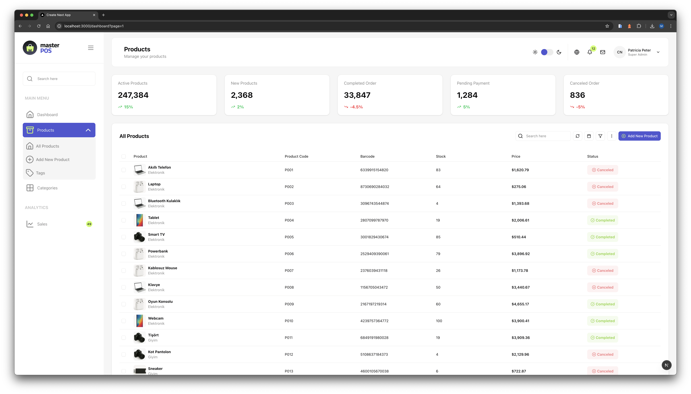

# Master POS Dashboard Design

## Tech Stack

- Next.js
- Tailwind CSS
- Shadcn UI
- Lucide Icons

## How to run the project

1. Clone the repository
2. Run `npm install` or `pnpm install`
3. Create a `.env` file and add the following:

```
API=https://api.example.com
```

4. Run `npm run dev` or `pnpm dev`
5. Open [http://localhost:3000/dashboard](http://localhost:3000/dashboard)

## How to use the project

### Product List and Pagination

Currently active features in the project:

1. Product List Viewing
2. Pagination Features
3. API Integration
